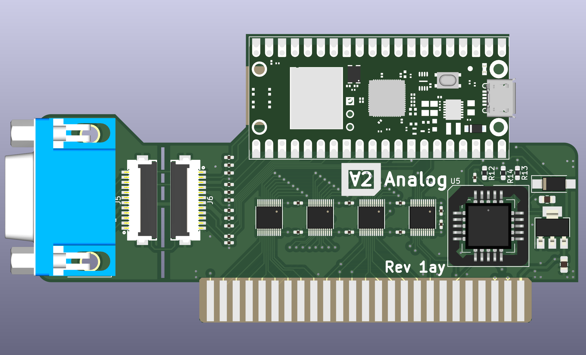

 

# Clone of ∀2 Retro Computing Analog VGA Card & PicoPal

Design files for the ∀2 Analog series of VGA cards

## Description
Modified version of V2RetroComputing's Apple II Analog VGA Expansion Board using KiCAD 6.0.x.  
Changes from original:
* Moved solder jumpers to the back of the board for both the (lack of) PAL/GAL and non WiFi Pico.
* Reorganized Schematic to more easily generate a BOM with Part numbers from LSCS, DigiKey, and Mouser.
* Adopted Hans Hübner's VGA port connector break-away feature. Also reworked board to be 2 layers vs 4 layers but kept 4x bus transcievers vs Han's 2 since the chip in the 4x variant is easier to obtain.
* Added a PLCC socket for the PAL/GAL chip that is getting difficult to find.  Be sure to bridge the solder jumper on the back if you don't plan to populate this socket.
* Re-adjusted layout to provide more Analog VGA signal clarity by making the traces as short as possible between the VGA port connector and the PICO.
* Switched from IDC header style to a shielded FPC cable for less chance of signal interference when using the optional break-away feature.
* Rounded off PCB corners where it made sense.  I hate getting stabbed by PCBs (Grrrr)!

This board should still be binary compatible with the software this hardware was forked from.

### PCB Layout

### See Also
https://github.com/V2RetroComputing/analog  
https://github.com/ayourk/Apple2Analog-VGA  
https://github.com/hanshuebner/AppleII-VGA  
https://github.com/markadev/AppleII-VGA  
[Apple II Expansion Card Size Specifications](V2A-Rev1/docs/Apple_II_ExpansionCard_Spec.txt)  
[Apple II Expansion Slot Pinout](V2A-Rev1/docs/Apple2SlotPinout.html)  
[Apple II Hardware Reference](V2A-Rev1/docs/Apple2HardwareReference.pdf)  
https://github.com/ayourk/Apple2Proto  

